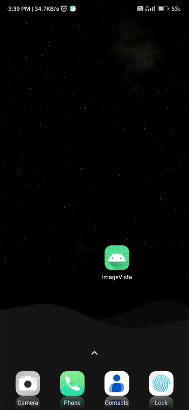

# :building_construction: Technology I Used :building_construction:

- **Jetpack Compose:** To build the User Interface
- **Material 3:** To Design a beautiful and consistent UI.
- **Paging 3:** To Implement efficient and smooth infinite scrolling.
- **Coil:** To Load and display images effortlessly.
- **Dagger Hilt:** To Manage dependency injection for cleaner, modular code.
- **Compose Navigation:** To Navigate between screens seamlessly.
- **Retrofit:** To Make network requests and handle API responses.
- **Room:** To Store and manage local data.

# **Screenshots** 

| Main Feed Screen                  | Search Screen                     | Bookmarks Screen                  |
|-----------------------------------|-----------------------------------|-----------------------------------|
|  |   |  |
| Profile (WebView)                 | Splash Screen                     | Preview Image                     | 
|  |   |  |
| Zoom Image                        | Download Image                    | Dark Mode                         |
|  |   |  |

